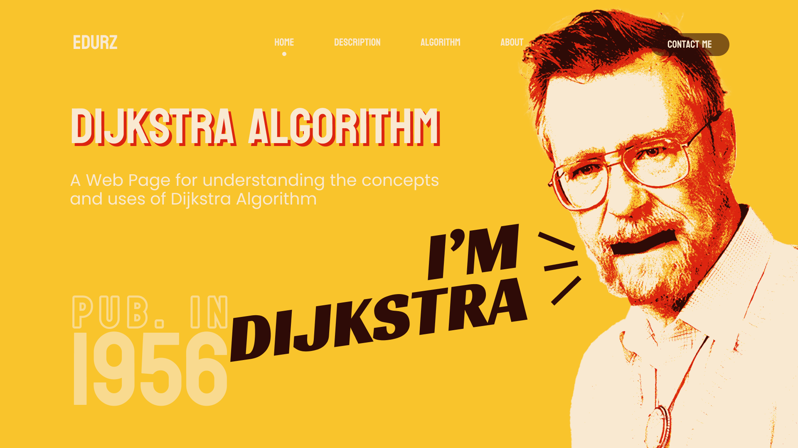
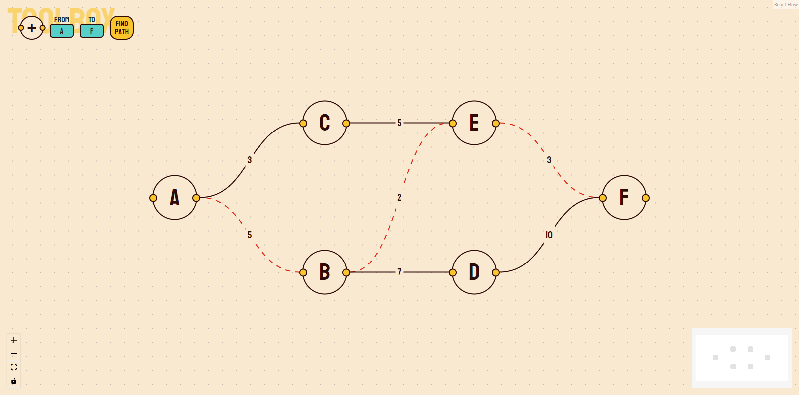

# no-dijkstra
Dijkstra's algorithm, conceived by computer scientist Edsger Dijkstra, is a graph search algorithm that solves in single-source shortest path problem for a graph with non-negative edge path costs, producing a shortest path tree.

🔗 URL: https://no-dijkstra.web.app/

> Home page of no-dijkstra project

> Editor page of no-dijkstra project
